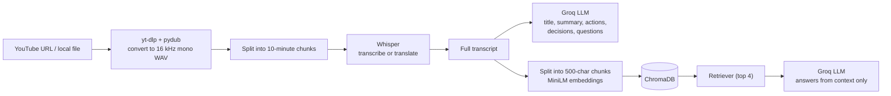

# 🎙️ AI Meeting Assistant

**Turn any meeting recording or YouTube video into a transcript, summary, action items, key decisions, and a chat assistant that answers questions about what was said.**


<!-- Replace the link below with your deployed app URL -->
[](https://ai-video-assistant-burhan.streamlit.app/)
---

## 📖 Table of contents

- [Overview](#-overview)
- [Live demo](#-live-demo)
- [Features](#-features)
- [How it works](#-how-it-works)
- [Tech stack](#-tech-stack)
- [Project structure](#-project-structure)
- [Prerequisites](#-prerequisites)
- [Installation](#-installation)
- [Usage](#-usage)
- [Configuration](#%EF%B8%8F-configuration)
- [Deployment](#-deployment)
- [Troubleshooting](#-troubleshooting)
- [Limitations and roadmap](#-limitations-and-roadmap)
- [Author](#-author)

---

## 🔎 Overview

Long meetings and lectures are hard to review. **AI Meeting Assistant** takes an audio or video source, transcribes it locally with OpenAI Whisper, and uses an LLM (served by Groq through LangChain) to produce structured notes. The transcript is also indexed in a vector database, so you can **chat with the meeting** and get answers grounded only in what was actually said.

It ships with two interfaces:

- a **Streamlit web app** (`app.py`) with a clean, tabbed UI
- a **command-line interface** (`main.py`) for quick terminal use

## 🚀 Live demo

**👉 [Try it here](https://ai-video-assistant-burhan.streamlit.app/)**

> **Note:** the demo runs on free hosting, so the first load can take a moment while the app wakes up and downloads its models. Long recordings take longer to process on a free CPU. If YouTube links fail on the hosted version (some platforms block downloads from cloud servers), use **Upload file** instead.

<!--
Add screenshots after you take them, e.g.:


-->

## ✨ Features

- **Flexible input:** paste a YouTube URL or upload a local audio or video file (mp3, wav, m4a, mp4, mkv, webm, mov).
- **Local speech-to-text:** Whisper runs on your machine, so your audio is not sent to a transcription API.
- **Optional translation:** turn on *Translate to English* to translate speech in another language into an English transcript.
- **Smart notes:** an auto-generated title, a summary, action items (with owner and deadline), key decisions, and open questions.
- **Chat with your meeting (RAG):** ask questions and get concise answers based only on the transcript. If the answer isn't there, the assistant says so instead of guessing.
- **Searchable transcript:** search the full text with highlighted matches.
- **Export:** download the report (`.md`) and the transcript (`.txt`).
- **Handles long recordings:** audio is split into 10-minute chunks, and long transcripts are summarized in parts and then combined.

## 🧠 How it works



1. **Ingest:** `utils/video_processor.py` downloads YouTube audio (or converts a local file) to WAV and splits it into chunks.
2. **Transcribe:** `core/transcriber.py` runs Whisper on each chunk and joins the text.
3. **Analyze:** `core/summarizer.py` and `core/extractor.py` send the transcript to the LLM to produce the title, summary, action items, decisions and questions.
4. **Index and chat:** `core/vector_store.py` embeds the transcript into ChromaDB, and `core/rag_engine.py` builds a retrieval chain that answers questions from the retrieved context.

## 🛠 Tech stack

| Layer | Technology |
|---|---|
| UI | [Streamlit](https://streamlit.io/) |
| Audio download / conversion | [yt-dlp](https://github.com/yt-dlp/yt-dlp), [pydub](https://github.com/jiaaro/pydub), FFmpeg |
| Speech-to-text | [OpenAI Whisper](https://github.com/openai/whisper) (local) |
| LLM | [Groq](https://groq.com/) (`openai/gpt-oss-120b`) |
| Orchestration | [LangChain](https://www.langchain.com/) (LCEL) |
| Embeddings | Hugging Face `all-MiniLM-L6-v2` via `sentence-transformers` |
| Vector store | [ChromaDB](https://www.trychroma.com/) |

## 📁 Project structure

```
ai-meeting-assistant/
├── app.py                  # Streamlit web interface
├── main.py                 # Pipeline + command-line interface
├── core/
│   ├── transcriber.py      # Whisper speech-to-text
│   ├── summarizer.py       # Title + chunked summarization
│   ├── extractor.py        # Action items, decisions, open questions
│   ├── vector_store.py     # Embeddings + ChromaDB
│   └── rag_engine.py       # Retrieval chain for chatting
├── utils/
│   └── video_processor.py  # Download, convert and chunk audio
├── .streamlit/
│   └── config.toml         # UI theme
├── requirements.txt
├── packages.txt            # System packages for Streamlit Cloud
├── Dockerfile              # For Hugging Face Spaces
├── .env.example
├── .gitignore
└── README.md
```

## ✅ Prerequisites

| Requirement | Why | Notes |
|---|---|---|
| **Python 3.10 – 3.12** | Runtime | Newer versions may not yet be supported by Whisper's dependencies |
| **FFmpeg** | Audio extraction and conversion | Must be on your `PATH` |
| **Deno** | Lets yt-dlp download from YouTube reliably | Recommended for YouTube links; not needed for file uploads |
| **Groq API key** | Runs the LLM | Free key at [console.groq.com/keys](https://console.groq.com/keys) |

**Install FFmpeg**

```bash
# Windows (PowerShell)
winget install Gyan.FFmpeg
# macOS
brew install ffmpeg
# Ubuntu / Debian
sudo apt update && sudo apt install ffmpeg
```

**Install Deno**

```bash
# Windows (PowerShell)
winget install DenoLand.Deno
# macOS
brew install deno
# Linux
curl -fsSL https://deno.land/install.sh | sh
```

Restart your terminal afterwards and confirm with `ffmpeg -version` and `deno --version`.

## 📦 Installation

```bash
# 1. Clone the repository
git clone https://github.com/burhan-arshad/ai-video-assistant.git
cd ai-video-assistant

# 2. Create and activate a virtual environment
python -m venv venv
# Windows
venv\Scripts\activate
# macOS / Linux
source venv/bin/activate

# 3. Install dependencies
pip install --upgrade pip
pip install -r requirements.txt

# 4. Add your API key
cp .env.example .env        # Windows: copy .env.example .env
# then open .env and set GROQ_API_KEY
```

> The first run downloads the Whisper model and the embedding model, so it needs an internet connection and may take a few minutes.

## ▶️ Usage

### Web app

```bash
streamlit run app.py
```

Then open the local URL shown in the terminal (usually `http://localhost:8501`).

1. In the sidebar, paste a YouTube link or upload an audio/video file.
2. Optionally turn on **Translate audio to English**.
3. Select **Analyze meeting** and wait for processing to finish.
4. Explore the **Summary**, **Action items**, **Decisions**, **Open questions**, and **Transcript** tabs.
5. Open the **Chat** tab and ask anything about the meeting, for example:
   - *"What were the main topics?"*
   - *"Who is responsible for what?"*
   - *"Were any deadlines mentioned?"*
6. Download the report or transcript from the sidebar.

### Command line

```bash
python main.py
```

You'll be asked for a YouTube URL or file path, whether to translate to English, and then you can chat with the meeting in the terminal (type `exit` to quit).

## ⚙️ Configuration

Settings live in `.env` (see `.env.example`):

| Variable | Required | Default | Description |
|---|---|---|---|
| `GROQ_API_KEY` | Yes | – | API key used for all LLM calls |
| `WHISPER_MODEL` | No | `small` | Whisper model size |

**Choosing a Whisper model** (approximate figures from the Whisper project):

| Model | Parameters | Approx. VRAM | Best for |
|---|---|---|---|
| `tiny` | 39 M | ~1 GB | Fastest, lowest accuracy; limited hosting |
| `base` | 74 M | ~1 GB | Good balance for demos |
| `small` | 244 M | ~2 GB | Default; solid accuracy on a laptop |
| `medium` | 769 M | ~5 GB | Better accuracy for difficult audio |
| `large` | 1550 M | ~10 GB | Best accuracy; needs a strong GPU |

The LLM model name and chunk sizes can be changed directly in the `core/` modules.

## ☁️ Deployment

This app runs Whisper and an embedding model **inside the server**, so it needs more memory than a typical Streamlit demo. Pick a host accordingly.

### Option A: Hugging Face Spaces (recommended)

Free *CPU basic* Spaces provide 2 vCPU and 16 GB RAM, which comfortably fits Whisper `base` or `small`.

1. Create a new Space at [huggingface.co/new-space](https://huggingface.co/new-space) with SDK **Docker → Blank** and hardware **CPU basic (free)**.
2. In the Space **Settings → Variables and secrets**, add a secret `GROQ_API_KEY` and (optionally) a variable `WHISPER_MODEL` (for example `base`).
3. Push this repository to the Space. The included `Dockerfile` installs FFmpeg, Deno and CPU-only PyTorch, then starts Streamlit on port 7860.
4. At the very top of the README **in the Space repository only**, add this front matter (Hugging Face requires it):

   ```yaml
   ---
   title: AI Meeting Assistant
   emoji: 🎙️
   sdk: docker
   app_port: 7860
   pinned: false
   ---
   ```

5. After the build finishes, your live link will look like `https://huggingface.co/spaces/YOUR-USERNAME/ai-meeting-assistant`. Paste it into the **Live Demo** badge at the top of this README.

### Option B: Streamlit Community Cloud

1. Push the repo to GitHub, then create an app at [share.streamlit.io](https://share.streamlit.io) with `app.py` as the main file.
2. Under **Advanced settings → Secrets**, add:

   ```toml
   GROQ_API_KEY = "your_groq_api_key_here"
   WHISPER_MODEL = "tiny"
   ```

3. `packages.txt` installs FFmpeg automatically.

**Caveats:** Community Cloud has tight resource limits (the docs list roughly 2.7 GB of RAM at the time of writing, and limits can change), so use `tiny` or `base` and expect slow processing. Deno is not available through `packages.txt`, so YouTube downloads may be limited; file uploads work normally.

## 🧯 Troubleshooting

| Problem | Fix |
|---|---|
| `FileNotFoundError` / *ffmpeg not found* | Install FFmpeg, add it to `PATH`, and restart the terminal |
| YouTube download fails, HTTP 403, or *Sign in to confirm you're not a bot* | Update yt-dlp: `pip install -U "yt-dlp[default]"`, install Deno, or use **Upload file** instead |
| `GROQ_API_KEY` errors / authentication failed | Check that `.env` exists in the project root and contains a valid key |
| `ModuleNotFoundError: No module named 'main'` | Run `streamlit run app.py` from the project root folder |
| App crashes or restarts on hosted platforms | Out of memory: set `WHISPER_MODEL=tiny` or `base` |
| *FP16 is not supported on CPU; using FP32* | Harmless warning from Whisper when no GPU is present |
| Very slow first run | Whisper and embedding models are downloading; later runs are faster |

## 🚧 Limitations and roadmap

- Whisper runs locally, so long recordings are slow on CPU-only machines.
- No speaker identification (diarization) yet, so the transcript is one continuous text.
- Output quality depends on audio quality and on the LLM.

**Ideas for the future:** speaker diarization, PDF export, saved meeting history, timestamps in the transcript, multi-language UI, and dark mode.

## 👤 Author

**Burhan Arshad** — Computer Science student

- GitHub: [@burhan-arshad](https://github.com/burhan-arshad)
- LinkedIn: [burhan-arshad](https://www.linkedin.com/in/burhan-arshad)

If you find this project useful, consider giving it a ⭐ on GitHub.

## 📄 License

Released under the [MIT License](LICENSE). Add a `LICENSE` file to your repository (GitHub can generate one for you when you create the repo or from **Add file → Create new file → LICENSE**).

## 🙏 Acknowledgements

[OpenAI Whisper](https://github.com/openai/whisper) · [LangChain](https://www.langchain.com/) · [Groq](https://groq.com/) · [ChromaDB](https://www.trychroma.com/) · [Hugging Face](https://huggingface.co/) · [yt-dlp](https://github.com/yt-dlp/yt-dlp) · [Streamlit](https://streamlit.io/)
